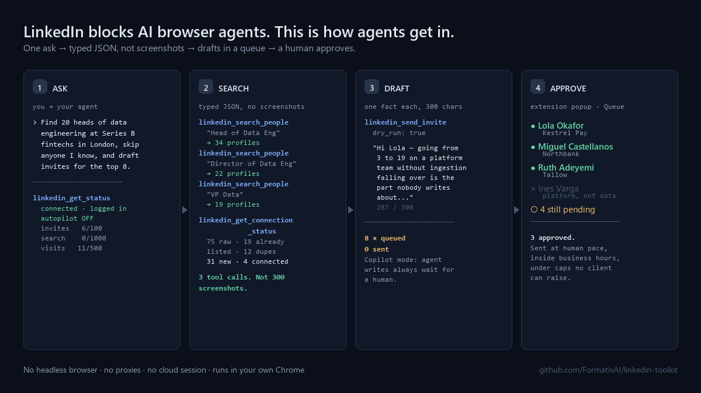
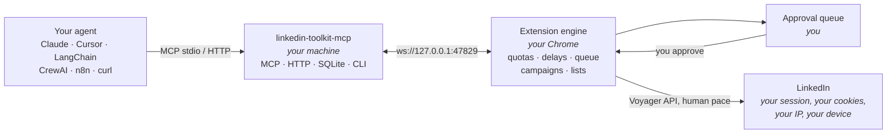

<div align="center">

# LinkedIn Toolkit

[](LICENSE)
[](docs/agents/README.md)
[](docs/why-browser-agents-fail-on-linkedin.md)
[](docs/architecture.md)
[](https://github.com/OpenRecruiterTools/linkedin-toolkit/actions/workflows/ci.yml)

### LinkedIn blocks AI browser agents. This is how agents get in.

</div>

Operator, Browser Use, computer-use models and Playwright bots get challenged or banned on
LinkedIn: headless fingerprints, datacenter IPs, machine-speed clicks. LinkedIn Toolkit gives any
agent a safe, structured API to **your own logged-in Chrome session** — through the same internal
endpoints the LinkedIn page itself calls, at human pace, under hard caps, with a human approval
queue. It is also a free replacement for Waalaxy and PhantomBuster if you never touch an agent at
all. No headless browser, no proxies, no cloud session, no telemetry, no subscription.

<div align="center">



<sub>*A 30-second demo GIF replaces this still shortly — see [docs/launch/record-demo.md](docs/launch/record-demo.md).*</sub>

</div>

## Install in 3 lines

```bash
# 1. Get the extension: download linkedin-toolkit-extension-v2.0.0.zip from Releases, unzip it,
#    then chrome://extensions → Developer mode → Load unpacked → pick the folder
# 2. Start the server (it prints a pairing token)
npx linkedin-toolkit-mcp
# 3. Paste the token into the extension popup → Settings → Local bridge
```

Then point your agent at it. Claude Code, `.mcp.json` in your project root:

```json
{
  "mcpServers": {
    "linkedin-toolkit": {
      "command": "npx",
      "args": ["-y", "linkedin-toolkit-mcp"]
    }
  }
}
```

That block works, verbatim, in Claude Desktop, Cursor, Windsurf, Cline and OpenClaw too. Zed,
Codex CLI and Gemini CLI want a slightly different shape — [one page each](docs/agents/README.md).

Not using MCP? `lit serve --http` gives you `POST /actions/{action}` and a generated
`GET /openapi.json`. [Examples in seven languages](examples/).

> [!IMPORTANT]
> **Nothing sends without you.** Copilot mode is the default: every write an agent makes queues
> for your approval in the popup. Hard caps live in the extension — 100 invites, 150 messages, 500
> profile visits, 1,000 search results a day — and no agent, CLI flag or config file can raise
> them. [Read the safety page](docs/safety.md) before you turn Autopilot on.

## What it does

| | |
|---|---|
| **Extract** | Profiles (full page text + photo), search, Sales Navigator, Recruiter, post likers and commenters, group members, event attendees, company employees, your own connections and followers, message threads. CSV, JSON and SQLite out. |
| **Lists and CRM** | Named lists, tags, dedupe across lists, a "contacted before" flag on every profile, and intent signals: engaged with a post, changed job in the last 90 days, at a target company. |
| **Sequences** | Visit, follow, connect with a note, message, InMail, like, comment, wait, and branch on accepted / replied / not accepted after N days. Variables with fallbacks, A/B variants per step, replies stop the sequence. [20 templates](sequences/). |
| **Inbox** | Unified threads, unread, reply detection, sentiment tagging, saved replies, snooze. |
| **Research Pack** | A CSV of names or domains in; a dossier, an enriched CSV and a list out. [Below](#research-pack). |
| **Agent layer** | 39 MCP tools, 4 resources, 3 prompts, a `/actions` HTTP API with OpenAPI 3.1, Node and Python clients, an n8n node, [6 skills](skills/). |
| **Safety** | Jittered human delays, hourly and daily caps, business hours, 14-day warm-up, account presets, approval queue, 429 backoff, 451 challenge auto-pause. |
| **Local everything** | `chrome.storage.local`, IndexedDB and a SQLite file on your machine. Read-only SQL over the lot. No server, no account, no telemetry. |

## Works with your agent

| Ecosystem | How | |
|---|---|---|
| Claude Code, Claude Desktop, Cursor, Windsurf, Zed, Cline, OpenClaw, Codex CLI, Gemini CLI | `npx linkedin-toolkit-mcp` | MCP over stdio · [config per client](docs/agents/README.md) |
| Remote and hosted agents (Claude API MCP connector, ChatGPT connectors, Cloudflare Agents) | `lit serve --http` | MCP over Streamable HTTP, token auth · [risks](docs/agents/chatgpt-connector.md) |
| OpenAI Agents SDK, Vercel AI SDK, LangChain.js, Mastra | `npm i linkedin-toolkit` | Typed client + tool definitions · [example](examples/openai-agents/) |
| LangChain, LlamaIndex, CrewAI, AutoGen, Google ADK, Pydantic AI, smolagents | `pip install linkedin-toolkit` | Python client + `@tool` wrappers per framework · [example](examples/crewai/) |
| n8n, Make, Dify, Flowise | `n8n-nodes-linkedin-toolkit` + MCP client node | Nodes for search, profile, invite, message, inbox, plus a webhook-fed trigger · [workflow](examples/n8n/) |
| Any HTTP agent | `lit serve --http` | `GET /openapi.json` — OpenAPI 3.1 for custom GPTs, Dify and code generators |
| Agent Skills standard | `skills/` | Six skills that load unchanged in Claude Code, OpenClaw, and any compliant runtime |

Structured errors carry `code`, `message`, `retryAfter` and `howToFix`, so an agent recovers or
explains itself instead of retrying into a wall. There is an
[`llms.txt`](llms.txt) and an [agent quickstart](docs/agents/quickstart.md) written for an agent to
read and self-install.

## Browser agents vs LinkedIn Toolkit

|  | Browser agent | LinkedIn Toolkit |
|---|---|---|
| **Session** | Headless or remote-controlled browser, cloud profile | Your own Chrome, your own login |
| **Fingerprint** | Synthetic — patched, and detectable anyway | Your real browser. Nothing to patch |
| **IP** | Datacenter, or a residential proxy of dubious provenance | Your own connection |
| **Detection** | Challenged, degraded, then restricted | No fingerprint or IP delta; volume and rhythm are still visible, which is why the caps exist |
| **What the agent sees** | Screenshots, vision tokens, brittle selectors | Typed JSON per tool |
| **Cost to source 100 profiles** | Hundreds of screenshots | 3 tool calls |
| **Pace** | Machine speed | Jittered human delays, business hours, warm-up |
| **Limits** | None until LinkedIn imposes them | Hard caps no client can raise |
| **On a challenge** | Retries, and makes it worse | Stops everything, tells the human |
| **Human oversight** | Whatever you remember to build | Approval queue, on by default |

The long version, with the actual detection mechanisms:
[**Why browser agents fail on LinkedIn**](docs/why-browser-agents-fail-on-linkedin.md).

## Why extensions broke, and why this one is built to be repaired

LinkedIn's web client now serves nearly all of its data through
`GET /voyager/api/graphql?queryId=<name>.<32-hex hash>&variables=(...)`, and those hashes change
with each web client release (current: 1.13.46474). The old REST Voyager paths that a generation of
2024–2025 extensions hard-coded return 400, 410 or 500 today. That is the mechanism — not a ban
wave. This extension calls the same GraphQL queries the page calls, from inside your own tab, and
keeps every query ID in one refreshable table with its capture date and client version:
[docs/voyager-endpoints.md](docs/voyager-endpoints.md). `lit endpoints check` reports which are ok,
failed or unverified, so drift is a maintenance task rather than an architecture change.

Honestly: those IDs **will** drift, and re-capturing them is the contribution this project most
needs. It is a table edit, not a rewrite — open DevTools on LinkedIn, filter the Network tab for
`voyager/api`, and copy the `queryId` from a request the page makes; the same hashes are also
literal strings inside LinkedIn's JS bundles if you would rather grep for them.

## Versus the paid tools

| | Waalaxy Pro | PhantomBuster Starter | Sales-Mind | **LinkedIn Toolkit** |
|---|---|---|---|---|
| Price | ~€70/mo | ~$69/mo | ~$99/mo | **£0** |
| Source | Closed | Closed | Closed | **MIT, all of it** |
| Where the automation runs | Their cloud *(the extension imports only)* | Their cloud | Their cloud | **Your own Chrome tab** |
| Your session | On their servers | On their servers | On their servers | **Never leaves your machine** |
| MCP server | ✗ | ✗ | ✗ | **✓** |
| Agent tools / SDKs | ✗ | ✗ | ✗ | **✓ 39 tools, 9 frameworks** |
| Local SQL over your data | ✗ | ✗ | ✗ | **✓** |
| Approval queue | ✗ | ✗ | ✗ | **✓ on by default** |
| Sequences with branching | ✓ | partial | ✓ | **✓** |
| Post engagers, groups, events | ✓ | ✓ | partial | **✓** |
| Inbox and sentiment | ✓ | ✗ | ✓ | **✓** |
| Team seats, dashboards | ✓ | ✓ | ✓ | ✗ *(needs a server — see [roadmap](docs/roadmap.md))* |
| Telemetry | ✓ | ✓ | ✓ | **✗** |

<sub>Competitor prices are public list prices checked September 2026 and are approximate — they
change, vary by currency and billing term, and each vendor's tiers differ. Feature claims are taken
from each vendor's public product pages, also checked September 2026, and tiers move. Check their
sites before deciding anything. Corrections welcome via PR — if we have a feature wrong, open one
and it gets fixed.<br>
Source for the Waalaxy column: its current Chrome extension listing, "Alien Copilot" by Waapi
(Montpellier) — v1.1.3, updated August 2026, roughly 2,000 users, 3.0★ from 3 ratings — which
describes itself as "your Waalaxy companion, helps you import prospects". On that listing the
extension imports prospects into Waalaxy, and the automation runs on Waalaxy's servers using your
session. Listing details read September 2026.</sub>

## Research Pack

Drop in a CSV with any of `name`, `linkedin_url`, `email`, `domain`, `company`. Get back a dossier
per row, an enriched CSV, and a list — all local.

```bash
lit research leads.csv --out ./packs
```

1. **Resolve** — match each row to a profile or company. Ambiguous rows come back with candidates
   and a confidence score for you to pick from, rather than a silent guess.
2. **Gather** — full profile capture, company page, recent posts and engagement, mutual
   connections, connection status.
3. **Signals** — job change in the last 90 days, recent posting activity, hiring signals,
   headcount band, mutuals, engaged-with-me.
4. **Enrich** *(optional, your key, off by default)* — verified email and phone.
5. **Web** — the [`linkedin-research-pack` skill](skills/linkedin-research-pack/SKILL.md) has
   **your agent** use its own web search for news, talks, GitHub and podcasts, and write them into
   the pack with sources. The extension never crawls the open web.
6. **Write** — `pack.md` and `pack.json` per row, an `output.csv` with every original column plus
   resolved URL, title, company, location, signals and match confidence, and a new list.

Caps apply throughout: resolution spends search quota, capture spends visit quota. A 500-row CSV is
a multi-day job by design, and you get the ETA up front.

## Safety

The honest position: **LinkedIn's User Agreement prohibits automated access.** This tool automates
LinkedIn. Nothing below makes that risk zero.

What it does do:

- **Hard caps in the extension**, below every client: 100 invites, 150 messages, 500 profile
  visits, 1,000 search results per day. `config.set` clamps whatever you pass.
- **Human pacing** — jittered 8–15 second delays, hourly caps, a business-hours window, weekdays
  only if you want. Machine-speed activity is the loudest signal an account can emit.
- **14-day warm-up** for new or dormant accounts.
- **Copilot mode** — every agent write queues for your approval. Autopilot is a toggle only a
  human can flip, in the popup. Approving still is not sending: the engine paces it anyway.
- **429 → backoff. 451 → stop.** A security challenge pauses every write immediately and stays
  paused until you clear it in Chrome. There is no retry loop anywhere in the codebase.
- **Never bypasses a security measure.** No CAPTCHA solving, no challenge circumvention, no
  proxies, no fingerprint spoofing, no cookie import, no account you are not signed into.

What it does **not** do is make you invisible. Running inside your own session removes the
fingerprint and IP signals that get browser agents caught — it does nothing about *how much* you
do or *how regularly* you do it, and LinkedIn counts both. That is exactly why the caps and the
pacing are not configurable past a ceiling: they are the only defence left once the easy tells are
gone. An account sending 90 invites a day at perfectly spaced intervals is still an account
sending 90 invites a day.

Recommended settings, signs to stop, and your data-protection obligations:
[**docs/safety.md**](docs/safety.md).

## Architecture



One engine, several clients: the popup, the CLI, an MCP tool call and a campaign step all go
through the same `handle(action, params, origin)` switch. The caps and the queue sit below it, so
there is no path around them — there is only one path. [Full architecture](docs/architecture.md) ·
[action contract](docs/actions.md) · [tool reference](docs/tools.md).

## CLI

`lit` ships in the same npm package as the server.

```bash
lit status
lit search "CTO fintech London" --source salesnav --count 100 --csv out.csv
lit profile https://www.linkedin.com/in/... --full --json
lit engagers <post-url> --list "Post engagers 8 Sep"
lit invite <profile-url> --note "..."                    # queues in Copilot mode
lit campaign create --from sequences/warm-connect.json --list "Data leads"
lit inbox --since 24h --sentiment
lit research leads.csv --out ./packs
lit sql "select company, count(*) from profiles group by 1 order by 2 desc limit 20"
lit export --table profiles --csv
lit serve --http                                         # HTTP MCP + /actions + /openapi.json
```

[Full reference](docs/cli.md) · [shell examples](examples/cli/).

## Your data is a SQLite file

Everything you capture mirrors into `~/.linkedin-toolkit/toolkit.db`. Agents get read-only SQL over
it — no network, no quota, no rate limit — and you can open the same file in any SQLite tool.

```sql
-- Who accepted an invite but never replied
SELECT p.full_name, p.company, p.headline, a.created_at
FROM actions a
JOIN profiles p ON p.public_id = a.public_id
WHERE a.action = 'outreach.invite' AND a.accepted = 1
  AND p.public_id NOT IN (SELECT from_public_id FROM messages)
ORDER BY a.created_at DESC;
```

```bash
lit sql "select company, count(*) n from profiles group by 1 order by n desc limit 20"
```

An agent reaches the same thing through `linkedin_query_sql` with `{ "sql": "SELECT …" }`.
`SELECT` only — anything else is rejected.

## Webhooks

The server POSTs `{ event, payload }` to a URL you set — `invite_accepted`, `reply_received`,
`positive_reply`, `campaign_step_done`, `campaign_completed`, `quota_hit`, `challenge_detected`,
`queue_item_added`, `queue_item_sent`, `campaign_note_truncated`, `research_progress`,
`research_completed`.

```bash
lit config set webhookUrl https://your-n8n/webhook/linkedin-events
```

[An importable n8n workflow](examples/n8n/) does the obvious thing with them: accepted invite →
`profile.get` → an LLM drafts a first message → it queues → Slack asks a human → approval link →
`queue.approve`.

## Skills

Six task recipes in the [Agent Skills](https://agentskills.io) format. They carry the guardrails —
facts only, quota awareness, the approval queue as the expected destination — not just the tool
sequence.

```bash
cp -r skills/* ~/.claude/skills/        # or ~/.openclaw/skills/, or ./.claude/skills/
```

[`linkedin-sourcer`](skills/linkedin-sourcer/SKILL.md) ·
[`linkedin-outreach-writer`](skills/linkedin-outreach-writer/SKILL.md) ·
[`linkedin-campaign-runner`](skills/linkedin-campaign-runner/SKILL.md) ·
[`linkedin-profile-to-dossier`](skills/linkedin-profile-to-dossier/SKILL.md) ·
[`linkedin-reply-triage`](skills/linkedin-reply-triage/SKILL.md) ·
[`linkedin-research-pack`](skills/linkedin-research-pack/SKILL.md)

## Roadmap

What is coming, and the things that will never be built because they need a server or break the
local-first guarantee: [**docs/roadmap.md**](docs/roadmap.md).

## Contributing

Adding an extractor is the best first contribution and touches four files:
[**how to build one**](docs/build-an-extractor.md). Sequences, skills and agent integrations are
merged fastest because they are additive and self-contained.

See [CONTRIBUTING.md](CONTRIBUTING.md), pick up a
[good first issue](https://github.com/OpenRecruiterTools/linkedin-toolkit/labels/good%20first%20issue), or
open a [Discussion](https://github.com/OpenRecruiterTools/linkedin-toolkit/discussions).

## Disclaimer

**THIS SOFTWARE IS PROVIDED "AS IS", WITHOUT WARRANTY OF ANY KIND.** The authors and contributors
accept **no responsibility or liability** for any consequences arising from its use, including but
not limited to:

- LinkedIn account restrictions, suspensions, or permanent bans
- Loss of connections, data, or account access
- Violation of LinkedIn's Terms of Service or User Agreement
- Any direct, indirect, incidental, or consequential damages

**By using this software you acknowledge that:**

1. LinkedIn's User Agreement prohibits automated tools and scraping, and using this may breach it
2. Doing so may result in action against your LinkedIn account, up to permanent loss
3. You use it **only on your own account**, in a session you logged into yourself
4. You are solely responsible for every action taken with it, and for your obligations under GDPR,
   the UK GDPR, CCPA or any equivalent law covering the personal data you collect
5. You use it entirely at your own risk

This tool **never bypasses a security measure**: no CAPTCHA solving, no challenge circumvention,
no detection evasion, no proxies, no cookie theft, no session sharing, no accounts you are not
signed into. When LinkedIn puts up a wall, it stops and hands the problem to you.

Provided for educational and research purposes. We do not encourage or endorse violation of any
platform's terms of service.

## License

[MIT](LICENSE).

## Contributors

<!-- ALL-CONTRIBUTORS-LIST:START - Do not remove or modify this section -->
<!-- prettier-ignore-start -->
<!-- markdownlint-disable -->
<!-- ALL-CONTRIBUTORS-LIST:END -->
<!-- markdownlint-enable -->
<!-- prettier-ignore-end -->

This project uses [all-contributors](https://allcontributors.org). Contributions of any kind are
recognised here — code, docs, sequences, skills, bug reports, and design.

To add someone, comment on any issue or PR:

```
@all-contributors please add @username for code, doc
```

## Credits

Built by **Dominic Gonsalves** —
[LinkedIn](https://www.linkedin.com/in/dominic-g-6a9a5680/) ·
[GitHub](https://github.com/FormatixAI)

If it is useful, a star helps other people find it.

[](https://star-history.com/#OpenRecruiterTools/linkedin-toolkit&Date)
