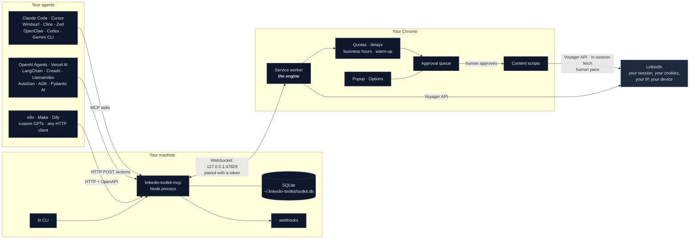
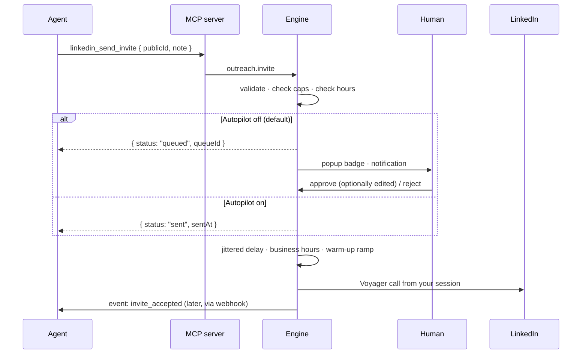

# Architecture

One engine, several clients. Everything that touches LinkedIn happens inside the user's own
Chrome, in their own logged-in session. Everything else is local plumbing around it.



Nothing in that diagram is a server you do not own. There is no hosted component, no cloud
session, no telemetry, and no headless browser anywhere in the project.

## The pieces

| Component | Runs | Owns |
|---|---|---|
| **Extension engine** (MV3 service worker) | Your Chrome | Every LinkedIn call, quotas, delays, backoff, campaign scheduling, the approval queue. The only component that talks to LinkedIn. |
| **Content scripts** | LinkedIn tabs | Full-page capture, photo capture, and the DOM fallbacks for actions Voyager will not serve (mass unfollow in `mode: 'dom'`, some likes and comments). Mass unfollow's default path is now the Voyager one, captured 2026-09-09. |
| **Popup / Options** | Chrome | The human control panel: lists, campaigns, inbox, queue, settings, BYOK keys, bridge pairing. |
| **MCP server** | Your machine (Node ≥ 20) | MCP over stdio and Streamable HTTP, the `/actions` HTTP API, `/openapi.json`, the SQLite mirror, the `lit` CLI, outbound webhooks. Holds no LinkedIn state of its own. |
| **Clients** | Wherever your agent runs | `linkedin-toolkit` on npm and PyPI, plus framework wrappers. Thin HTTP. |
| **Skills** | Your agent workspace | Task recipes in the Agent Skills format. Prompts, not code. |

## One engine, one action schema

The single most important design decision: **the popup and the MCP server are two clients of the
same engine.** There is one `handle(action, params, origin)` switch in the service worker, and
every path — a button in the popup, a `lit` command, an MCP tool call, a campaign step firing on
an alarm — goes through it.

```
popup ──┐
lit ────┤
MCP ────┼──▶ engine.handle(action, params, origin) ──▶ quota gate ──▶ Voyager ──▶ envelope
n8n ────┤                                                  │
agents ─┘                                                  └──▶ approval queue (Copilot mode)
```

This is why an agent cannot do anything a human could not do in the popup, and cannot do it
faster. The caps, the jitter, the business-hours window and the queue live below the switch. There
is no path around them, because there is only one path.

Actions are namespaced strings: `profile.get`, `search.people`, `outreach.invite`,
`campaign.create`, `queue.approve`. They are documented in [`actions.md`](actions.md), validated at
the boundary, and mirror one-to-one onto MCP tool names ([`tools.md`](tools.md)).

## The bridge

The MCP server runs a WebSocket server on `127.0.0.1:47829`. The extension connects **out** to it.

```
extension ──▶ { type: "hello", token, extensionVersion }
server    ──▶ { type: "hello_ok", serverVersion }        or close(4001, UNAUTHORIZED)

server    ──▶ { id, action, params }
extension ──▶ { id, ok: true, data, rateLimit }  |  { id, ok: false, error }
extension ──▶ { event, payload }                 ← unsolicited: accepted, replied, quota, challenge
```

- The server prints a pairing token on first run. You paste it into the popup once.
- Localhost only. Bad token, closed connection.
- The extension reconnects with backoff 1s → 2s → 4s → … → 60s, and on `onStartup`, `onInstalled`
  and every alarm tick.
- MV3 keeps the service worker alive while a WebSocket is active (Chrome 116+), which is what
  makes a long-running campaign engine possible in an extension at all.
- The MCP server never opens LinkedIn. If the extension is not attached, every tool returns
  `EXTENSION_OFFLINE` with instructions rather than silently doing nothing.

## Data

**In the extension.** `chrome.storage.local` for config, quotas, lists, campaigns, queue and the
inbox cache. IndexedDB for profile bodies and photos, because `storage.local` has a size ceiling
you will hit at a few thousand profiles.

**On your machine.** `~/.linkedin-toolkit/toolkit.db`, SQLite via `better-sqlite3`. Tables:
`profiles`, `companies`, `searches`, `search_results`, `lists`, `list_members`, `campaigns`,
`enrollments`, `actions`, `conversations`, `messages`, `events`. The server pulls with `sync.pull`
after every action and on a timer, so the mirror is a few seconds behind at worst.

The database is the export. `linkedin_query_sql` gives an agent read-only `SELECT` over everything
you have ever captured — no quota, no rate limit, no network — and you can open the same file in
any SQLite tool. CSV and JSON export exist too, from the popup and the CLI.

## Writes: the queue

Copilot mode is the default and it is the whole safety argument.



Approval is not the same as sending. Even an approved item waits for a jittered delay, the
business-hours window, and the hourly and daily caps. A human clicking "approve all" on forty
invites does not produce forty invites in a minute; it produces forty invites over the next few
days.

## AI, in two optional layers

1. **Agent-native.** MCP tools and skills. Your agent is the brain, you need no keys, and nothing
   is sent anywhere you have not already chosen.
2. **BYOK in the popup.** A provider interface with adapters for Anthropic, OpenAI, Gemini,
   Ollama, and any OpenAI-compatible base URL, used for opener writing, profile summaries, reply
   sentiment, comment drafting and list scoring. Keys live in `chrome.storage.local` and nowhere
   else. With Ollama (`llama3.1:8b` by default) the entire system — including the model — runs on
   your machine.

## What is deliberately absent

- **No headless browser.** No Playwright, Puppeteer, or CDP, anywhere, including tests. See
  [why-browser-agents-fail-on-linkedin.md](why-browser-agents-fail-on-linkedin.md).
- **No proxies, no residential IPs, no cookie import, no session sharing.** Your account, your IP,
  your device.
- **No hosted service.** Nothing to sign up for, nothing to log into, nothing to leak.
- **No telemetry.** The project does not know you exist.
- **No cloud sessions, team dashboards, or role permissions.** They need servers, and servers
  break the local-first guarantee that is the entire point.
- **No Chrome Web Store listing.** Distribution is a release zip and load-unpacked.

## Repository layout

```
extension/       Chrome MV3 extension — the engine. No build step, no dependencies.
mcp-server/      npm linkedin-toolkit-mcp: MCP stdio + HTTP, bridge, SQLite, lit CLI, webhooks
clients/node/    npm linkedin-toolkit: typed client + tool definitions
clients/python/  PyPI linkedin-toolkit: client + framework wrappers
clients/n8n/     n8n-nodes-linkedin-toolkit
skills/          six skills in the Agent Skills format
sequences/       20 campaign templates + JSON Schema + validator
examples/        one working example per agent ecosystem
docs/            this
```

Adding a new extractor touches four files and is the best first contribution to this repo:
[build-an-extractor.md](build-an-extractor.md).
