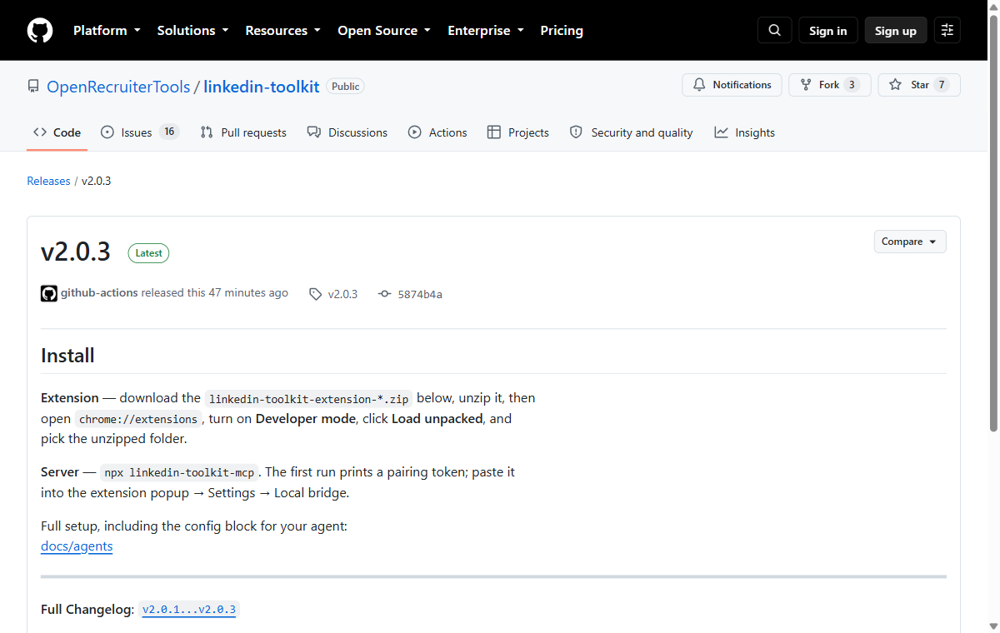
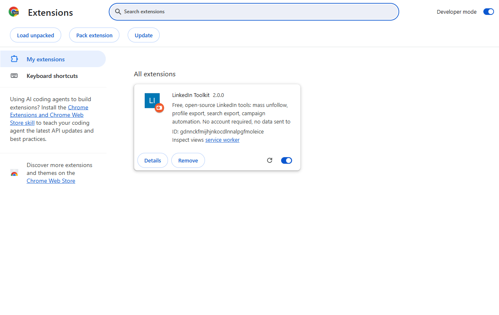
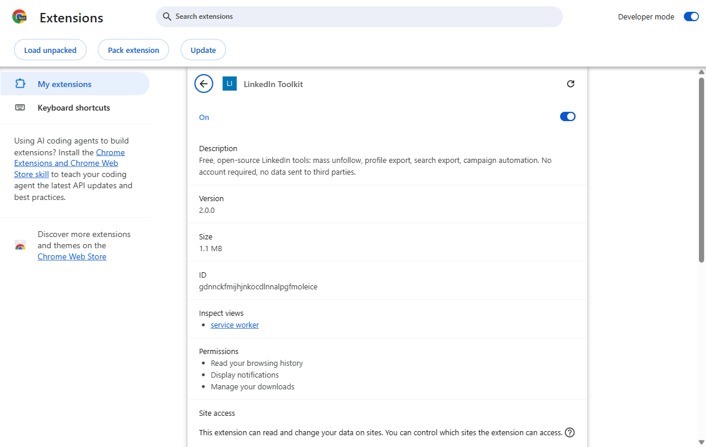
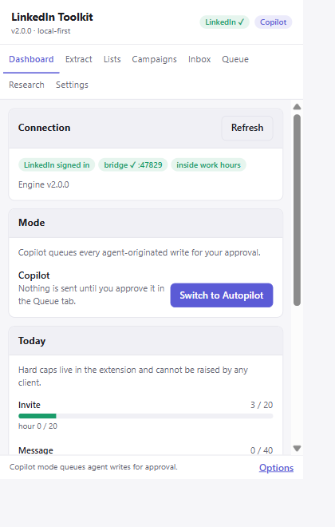
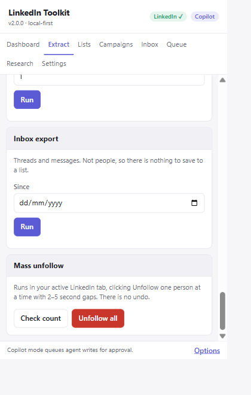

# Installing LinkedIn Toolkit

This page is for installing the Chrome extension and using it by hand. You do not
need to know what a terminal is, and you do not need to install anything else.
It takes about five minutes.

(If you want to connect an AI agent to it as well, do this page first, then read
[docs/agents](agents/README.md).)

**Before you start, read this once.** LinkedIn's User Agreement does not allow you
to automate your account, and LinkedIn restricts and permanently bans accounts for
it. Mass unfollow clicks buttons on your own account, in your own browser, and
LinkedIn cannot tell that apart from you clicking fast. That risk is yours. Do not
use this on an account you cannot afford to lose. The longer version is in
[docs/safety.md](safety.md).

---

## Install it

### 1. Download the file

Go to the [Releases page](https://github.com/OpenRecruiterTools/linkedin-toolkit/releases)
and, under the newest release, click the file whose name ends in `.zip` — it is
called something like `linkedin-toolkit-extension-v2.0.0.zip`.

### 2. Unzip it, and put the folder somewhere you will keep it

Double-click the downloaded file (Windows: right-click → *Extract All*). You get a
folder with the same name.

**Move that folder somewhere permanent** — Documents is fine. Chrome loads the
extension from this folder every single time it starts, so if you leave it in
Downloads and later clear out Downloads, the extension disappears.

### 3. Open Chrome's extensions page

Type `chrome://extensions` into the address bar and press Enter. (It will not
appear in search results — it has to be typed into the address bar.)

Turn on **Developer mode** with the switch in the top-right corner. Three new
buttons appear along the top.

### 4. Click "Load unpacked" and choose the folder

Click **Load unpacked**. Your computer's normal folder-picker window opens — the
same one you would get opening any file.

Find the folder you unzipped in step 2 and select the folder *itself* (do not open
it and pick a file inside; if you can see a file called `manifest.json` listed,
you are in the right folder — go up one level and select that folder, or just
click *Select Folder* / *Open* while it is highlighted).

### 5. Check it loaded

"LinkedIn Toolkit" now appears as a card on the extensions page.

If instead you get a red error, the most common cause is picking the wrong folder
in step 4 — one level too high or too low. Delete the card and try again.

### 6. Pin the icon so you can find it

Click the jigsaw-piece icon at the top-right of Chrome, find "LinkedIn Toolkit" in
the list, and click the pin next to it. Its icon now sits next to the address bar,
where you can reach it in one click.

### 7. Open LinkedIn, then open the popup

Go to [linkedin.com](https://www.linkedin.com/) and sign in as normal. Then click
the LinkedIn Toolkit icon.

The popup only works on a tab where you are signed in to LinkedIn — that is where
it gets its access from. There is no account to create and no password to give it.

---

## Clean your feed

The "Mass unfollow" panel, at the bottom of the **Extract** tab, unfollows people
and pages so your feed calms down. It does **not** remove anyone from your
connections — they stay connected to you, you just stop seeing their posts.

Open LinkedIn in the tab you are going to use, click the toolkit icon, and go to
the Extract tab. Then work through these three steps in order. Do not skip to the
third one.

### Step 1 — Preview

Leave "Unfollow up to" at 25 and click **Preview**.

Nothing is unfollowed. The toolkit walks your Following list exactly as it would
for real, and shows you the list of names it *would* unfollow. Read it. If those
are not the people you expected, stop here — nothing has happened.

### Step 2 — Unfollow a small number first

Change "Unfollow up to" to **1**, then click **Unfollow all** and confirm.

Watch the LinkedIn tab: you will see it open your Following list and press one
button. When it finishes, it tells you who it unfollowed. Check that person really
is unfollowed on LinkedIn.

That is the whole point of the number box. Try it on one person, then on five,
before you trust it with eight hundred.

### Step 3 — Then the rest

Once you have seen it work, set the number to whatever you want — or clear the box
entirely to work through everyone — and run it.

While it runs:

- **Leave the tab alone.** It clicks the tab you pointed it at. If you navigate
  that tab somewhere else, the run stops immediately and tells you so; it will
  never follow you to another tab.
- **It is slow on purpose.** One person every 2–5 seconds. A burst of clicks is
  exactly what gets accounts restricted, so it does not do that. Eight hundred
  people takes roughly an hour. You can carry on working in other tabs.
- **If LinkedIn interrupts** with a security check or a "we noticed unusual
  activity" page, the run stops on the spot and reports how far it got. Do not
  restart it that day.
- **There is no undo.** Unfollowing 800 people cannot be reversed in bulk; you
  would have to re-follow each of them by hand.

"Check count" tells you how many accounts you currently follow, plus the first few
names, without changing anything.

---

## If something goes wrong

**The icon is greyed out or the popup is empty.** You are not on a LinkedIn tab,
or you are not signed in. Open linkedin.com, sign in, then click the icon again.

**"Mass unfollow runs in your own browser tab…"** You reached the action from
somewhere other than the popup. That is deliberate — this one action can only be
started by a person, never by an agent.

**Nothing happens when you press Unfollow.** Check the LinkedIn tab is actually on
your Following list. The toolkit will navigate there itself; give it a few seconds
on a slow connection.

**Chrome says the extension is corrupted, or it vanishes after a restart.** The
folder moved or was deleted. Re-download, unzip somewhere permanent, and load it
again.

**Updating to a new version.** Download the new zip, unzip it over (or next to)
the old folder, then click the refresh arrow on the extension's card at
`chrome://extensions`.

---

## Why it is not in the Chrome Web Store

Store policy forbids extensions that facilitate breaking another site's terms of
service, and an honest reading of LinkedIn's terms puts automating your own
account in that territory. Loading it unpacked keeps the decision — and the code
you are running, which you can read — with you.
